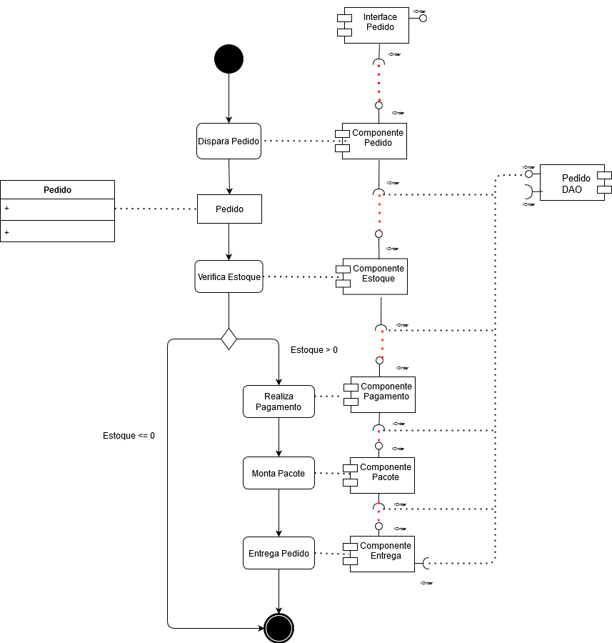
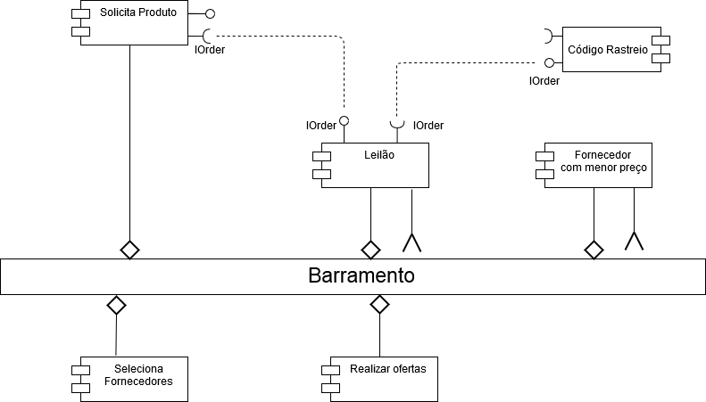
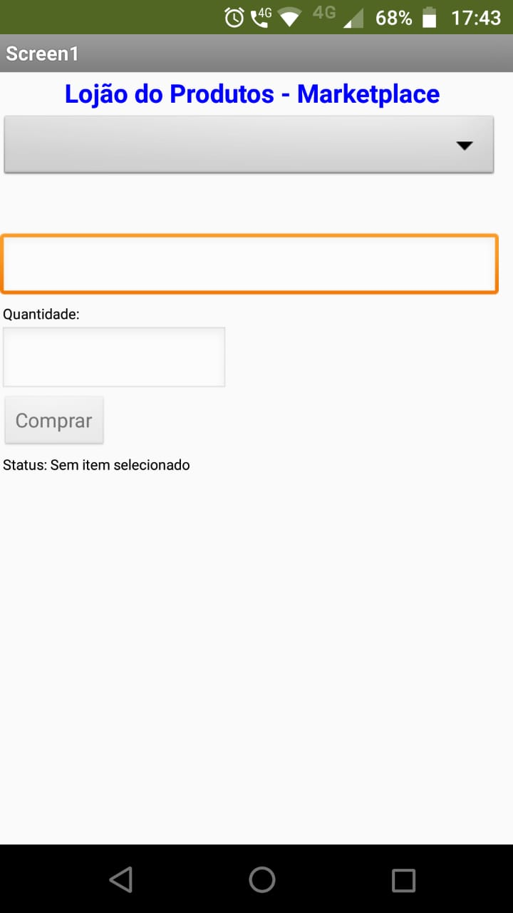
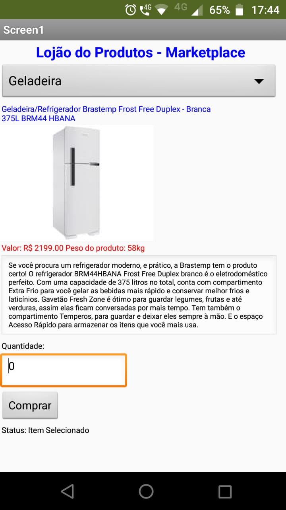
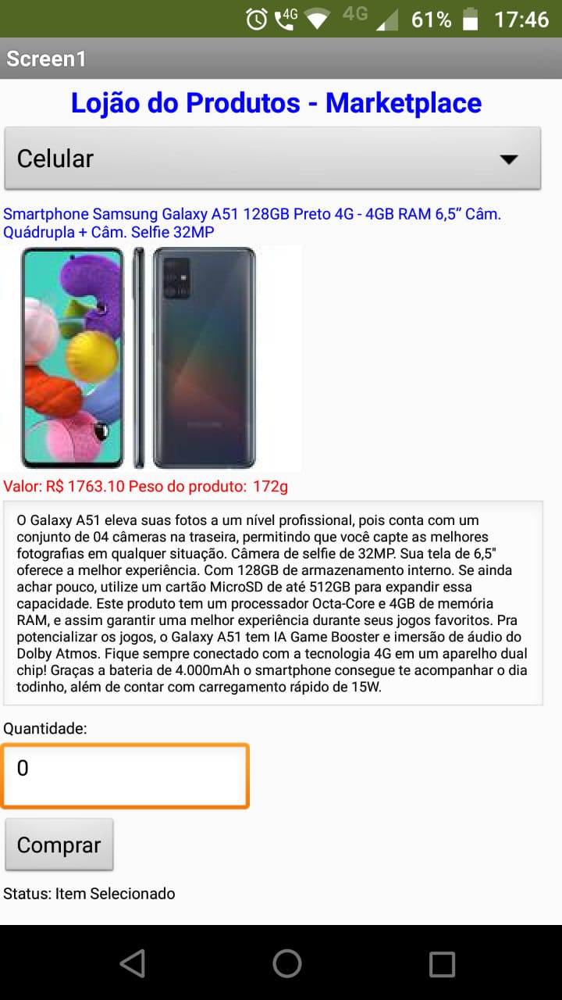
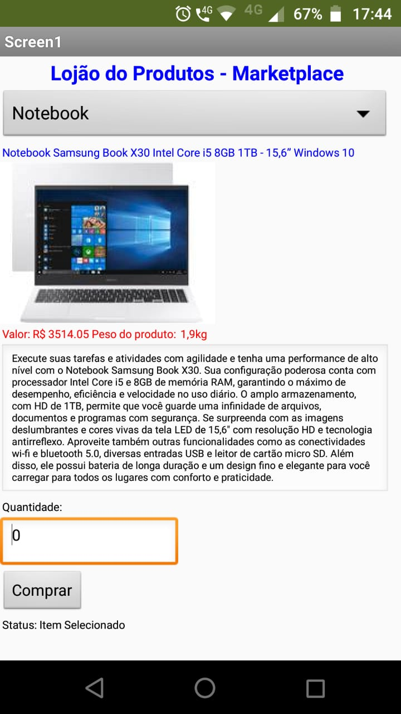
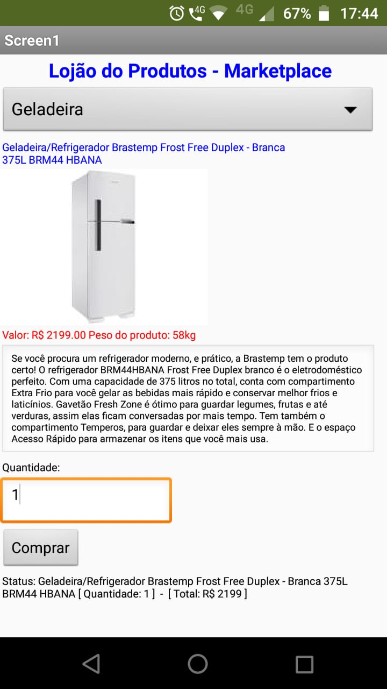

# Lab03 - Model-View-Controller

## Tarefa 1

## Tarefa 2

1. O processo se inicia no componente "Solicita Produto" onde o comprador escolhe o que deseja comprar. (Solicita Produto)

2. O componente leilão se encarrega de gerenciar as mensagens dos componentes no barramento. (Leilão)

3. Selecionar fornecedores elegiveis a fornecer o produto solicitado. (Seleciona Fornecedores)

4. O fornecedor oferece o melhor preço para o produto. (Realizar ofertas)

5. Os tres menores preços serão apresentados e obedecendo o critério de classificação/desempate. (Forncedor com menor preço)

6. O código de rastreio será enviado após a escolha do fornecedor. (Código Rastreio)

## Tarefa 3 
 * tela 1 - nenhum produto selecionado
 

 * tela 2 - produto geladeira selecionado
 

 * tela 3 - produto celular selecionado
 

 * tela 4 - produto notebook selecionado
 

 * tela 5 - compra de um dos produtos efetiva
 

 * tela 6 - diagrama de blocos do aplicativo
 

 * Link para o arquivo do aplicativo exportado a partir do MIT App Inventor em formato `aia`.
[Projeto MIT App Inventor](app/ProjectTarefa4.aia)

## Tarefa 4

[https://github.com/inf331Equipe05](https://github.com/inf331Equipe05)