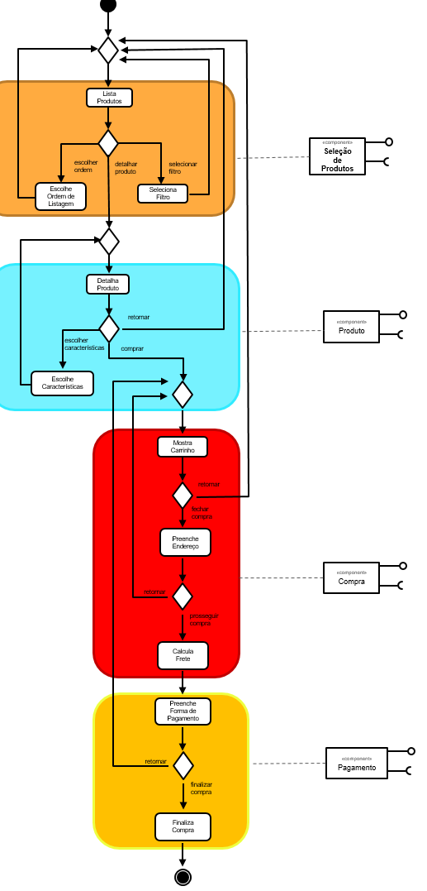
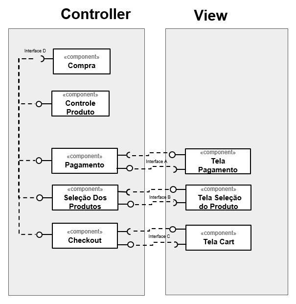
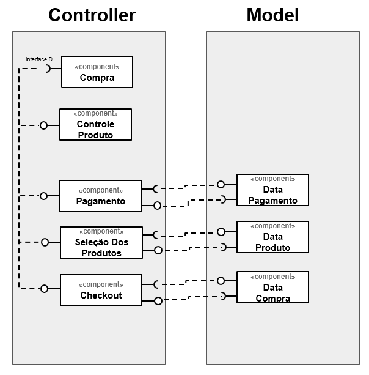

# Apresentação do Lab04 - Serviços

## Tarefa 1

## Tarefa 2

## Tarefa 3

## Tarefa 4

### Serviço 1

* **Título do serviço**: `API-Oxford Dictionaries`
* **Breve descrição**:
  Serviço que baseado num idioma selecionado retorna significado de palavras.
* **URL completa da requisição**: `https://od-api-demo.oxforddictionaries.com`
* **Cabeçalho HTTP da chamada**:
~~~http
Request URL: https://any-api.com:8443/https://od-api-demo.oxforddictionaries.com:443/api/v1/domains/en
Request Method: GET
Status Code: 404 
Remote Address: [2606:4700:3030::6812:3dce]:8443
Referrer Policy: no-referrer-when-downgrade
~~~
* **Cabeçalho HTTP da resposta**:
~~~http
access-control-allow-origin: *
cf-cache-status: DYNAMIC
cf-ray: 5ca1894e6e7709bc-GIG
cf-request-id: 04d8d42501000009bce5833200000001
date: Fri, 28 Aug 2020 22:40:51 GMT
expect-ct: max-age=604800, report-uri="https://report-uri.cloudflare.com/cdn-cgi/beacon/expect-ct"
server: cloudflare
set-cookie: __cfduid=dc0bbf4b51730f522f0c79a920393e91c1598654450; expires=Sun, 27-Sep-20 22:40:50 GMT; path=/; domain=.any-api.com; HttpOnly; SameSite=Lax
status: 404
~~~
* **Conteúdo da resposta**:
~~~json
{
  Not found because of proxy error: Error: getaddrinfo ENOTFOUND od-api-demo.oxforddictionaries.com od-api-demo.oxforddictionaries.com:443
}
~~~

### Serviço 2

* **Título do serviço**: `API-Freesound`
* **Breve descrição**:
  Serviço que busca músicas dentro de sua biblioteca de opções.
* **URL completa da requisição**: `http://www.freesound.org/`
* **Cabeçalho HTTP da chamada**:
~~~http
Request URL: https://any-api.com:8443/http://www.freesound.org/apiv2/search/text?sort=downloads_asc&page=1&page_size=15
Request Method: GET
Status Code: 401 
Remote Address: [2606:4700:3030::6812:3dce]:8443
Referrer Policy: no-referrer-when-downgrade
~~~
* **Cabeçalho HTTP da resposta**:
~~~http
access-control-allow-origin: *
access-control-expose-headers: server,date,content-type,content-length,connection,vary,allow,access-control-allow-origin,www-authenticate,x-final-url
allow: GET, HEAD, OPTIONS
cf-cache-status: DYNAMIC
cf-ray: 5ca28516cd26f853-GIG
cf-request-id: 04d971823e0000f8530134c200000001
content-length: 114
content-type: application/xml; charset=utf-8
date: Sat, 29 Aug 2020 01:32:44 GMT
expect-ct: max-age=604800, report-uri="https://report-uri.cloudflare.com/cdn-cgi/beacon/expect-ct"
server: cloudflare
set-cookie: __cfduid=db8c0fae5754400e60a2695ab9b2d1ffb1598664763; expires=Mon, 28-Sep-20 01:32:43 GMT; path=/; domain=.any-api.com; HttpOnly; SameSite=Lax
status: 401
vary: Accept, Cookie
www-authenticate: Bearer realm="api"
x-cors-redirect-1: 301 http://www.freesound.org/apiv2/search/text/?sort=downloads_asc&page=1&page_size=15
x-final-url: http://www.freesound.org/apiv2/search/text/?sort=downloads_asc&page=1&page_size=15
x-request-url: http://www.freesound.org/apiv2/search/text?sort=downloads_asc&page=1&page_size=15
~~~
* **Conteúdo da resposta**:
~~~json
<root>
	<detail>Authentication credentials were not provided.</detail>
</root>
~~~