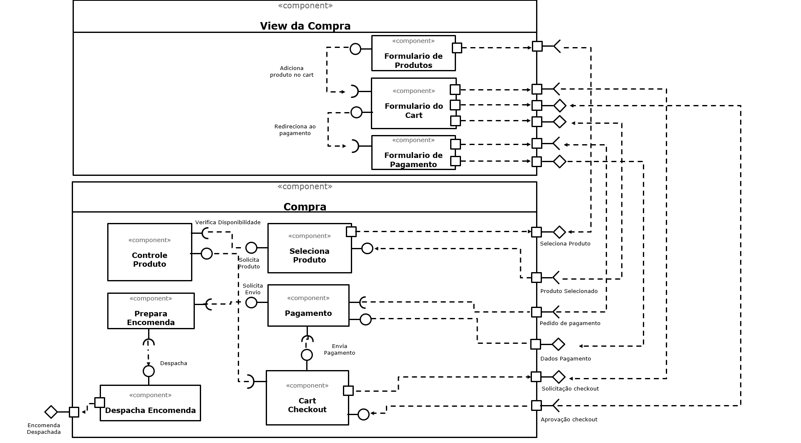

# Apresentação do Lab05 - Subcomponentes e Páginas Dinâmicas

## Tarefa 1

## Tarefa 2

Link para o projeto no Codepen: 
[https://codepen.io/willrsp/pen/xxVPaPJ](https://codepen.io/willrsp/pen/xxVPaPJ)

código do seu componente:

**HTML**
~~~html

~~~

**JavaScript**
~~~javascript
class Barra extends React.Component {
  render() {
    let resultado = "";
    for (let b = 1; b <= this.props.tamanho; b++)
      resultado += "=";
    return resultado;
  }
}

class SetTextColor extends React.Component {
  render() {
    var textColor = this.props.color;
    var str = this.props.text; 
    var result = {str}    
    return result;
  }
}

const elemento = 

                   <h2><SetTextColor text="O dinossauro" color="red"/></h2>        
                   <SetTextColor text=<Barra tamanho="10"/> color="yellow"/>       
                   <h2><SetTextColor text="pulou na lama." color="green"/></h2>
                 

ReactDOM.render(elemento, 
        document.getElementById("root"));
~~~